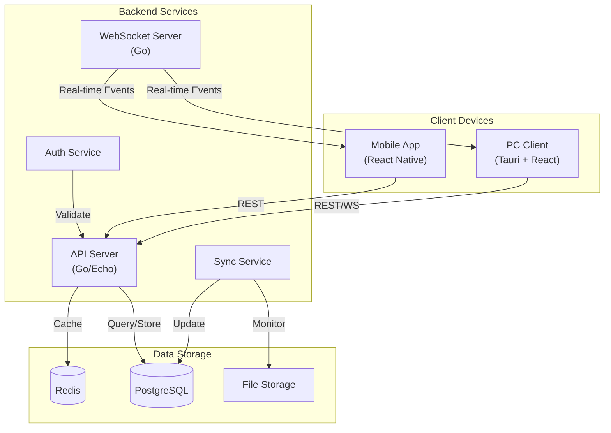

# CloudStore Architecture

## System Overview

CloudStore is a distributed system that enables users to turn their PC into a personal cloud storage solution. The system consists of multiple components that work together to provide seamless file synchronization and access.

## Architecture Diagram



## Component Details

### 1. PC Client (Tauri + React)

- Desktop application for file management
- Local file system monitoring
- Real-time synchronization
- Offline support

### 2. Mobile App (React Native)

- File browsing and management
- Download and upload capabilities
- Share functionality
- Push notifications

### 3. Backend Services (Go)

- RESTful API endpoints
- WebSocket server for real-time updates
- Authentication and authorization
- File synchronization logic

### 4. Data Storage

- PostgreSQL for structured data
- Redis for caching and real-time features
- Local file system for actual file storage

## Communication Flow

1. **File Upload**

   ```mermaid
   sequenceDiagram
       participant Client
       participant API
       participant DB
       participant Storage

       Client->>API: Upload file request
       API->>DB: Create file record
       API->>Storage: Store file
       Storage-->>API: Storage confirmation
       API-->>Client: Upload success
   ```

2. **Real-time Sync**

   ```mermaid
   sequenceDiagram
       participant PC
       participant WS
       participant Sync
       participant DB

       PC->>WS: Connect WebSocket
       PC->>Sync: File changed
       Sync->>DB: Update metadata
       WS->>PC: Sync notification
   ```

## Security

1. **Authentication**

   - JWT-based authentication
   - Refresh token rotation
   - Rate limiting

2. **Data Protection**

   - End-to-end encryption
   - Secure file transfer
   - Data at rest encryption

3. **Access Control**
   - Role-based access control
   - File sharing permissions
   - API endpoint protection

## Scalability

1. **Horizontal Scaling**

   - Stateless API servers
   - Redis cluster for caching
   - PostgreSQL replication

2. **Performance**
   - CDN integration
   - File chunking
   - Efficient delta sync

## Monitoring

1. **Metrics**

   - API response times
   - Storage usage
   - Sync status

2. **Logging**
   - Structured logging
   - Error tracking
   - Audit trail

## Future Improvements

1. **Features**

   - Selective sync
   - Version control
   - Team collaboration

2. **Technical**
   - Multi-region support
   - Enhanced offline capabilities
   - Improved conflict resolution
